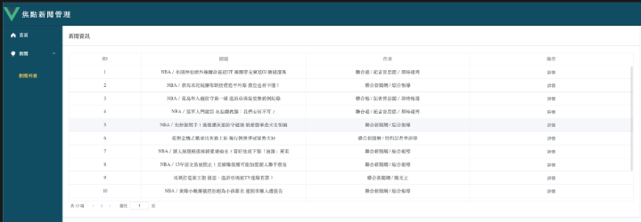

# Unnotech Backend Engineer 徵才小專案

- [x] 抓取 http://tw-nba.udn.com/nba/index 中的焦點新聞。 
- [x] 使用 [Django](https://www.djangoproject.com/) 設計恰當的 Model，並將所抓取新聞存儲至 DB。 
- [x] 使用 [Django REST Framework](http://www.django-rest-framework.org/) 配合 AJAX 實現以下頁面：
  - [x] 焦點新聞列表
  - [x] 新聞詳情頁面
- [x] 以 Pull-Request 的方式將代碼提交。
	
## 進階要求
- [x] 實現爬蟲自動定時抓取。
- [x] 使用 Websocket 服務，抓取到新的新聞時立即通知前端頁面。
- [x] 將本 demo 部署到伺服器並可正確運行。 
- [ ] 所實現新聞列表 API 可承受 100 QPS 的壓力測試。

## 本次實作說明
### 後端
使用Django REST framework 完成後端功能

1. 有完成客製化分頁，結構如下
    ```json
    {
        "code": 200,
        "meta": {
            "pages": 1,
            "per_page": 10,
            "count": 1,
            "page": 1
        },
        "data": [
            {
                "id": 1,
                "title": "NBA／布朗神仙球外線續命逼近OT 塞爾蒂克東冠G1險退溜馬",
                "content": "綠衫軍靠布朗 5.7秒的追平三分彈續命，將溜馬逼進延長賽後勝出。 美聯社\n由塞爾蒂克隊和溜馬隊進行的東區決賽今天點燃戰火，塞爾蒂克開賽打出12：0強攻，但溜馬展現韌性，半場打完追平比數，第三節再從13分落後逆轉戰局，第四節一舉反超，不過綠衫軍靠布朗（Jaylen Brown） 5.7秒的追平三分彈續命，延長賽泰托姆（Jayson Tatum）再有連拿6分演出，讓「綠衫軍」驚險以133：128搶下首勝。\n例行賽打下聯盟最佳戰績的塞爾蒂克，前兩輪都只花5戰就晉級，今天面對前一輪打滿7戰才出線的溜馬，「綠衫軍」再打出12：0的開賽猛攻，但溜馬在中鋒透納（Myles Turner）領軍下縮小差距，首節打完追近到31：34，第二節更在哈利伯頓（Tyrese Haliburton）大號壓線三分彈下以64：64追平比分。\n第三節溜馬在哈利伯頓連拿5分下反超比數，但塞爾蒂克靠老將霍福特（Al Horford）外線破網回應一波28：10猛攻，領先擴大到92：79，不過溜馬有席亞康、麥克康奈爾（T.J. McConnell）和奈史密斯（Aaron Nesmith）回敬9：0攻勢回到比賽，哈利伯頓更投進彈框進球的壓哨三分彈，三節打完再將比數緊咬到93：94。\n第四節席亞康（Pascal Siakam）進球讓溜馬1分反超，拉鋸時刻奈哈德（Andrew Nembhard）也加入得分行列，他最後39.1秒進球更讓溜馬取得117：114領先。\n塞爾蒂克追分階段泰托姆外線失手，雖靠溜馬失誤再有進攻機會，懷特（Derrick White）切入和泰托姆的外線也無果，不過溜馬再出現失誤，讓塞爾蒂克球星布朗5.7秒投進底角追平外線；溜馬最後一擊哈利伯頓再被守住，比賽117：117進入延長賽。\nJAYLEN BROWN TIES THE GAME AT 117!\n5 SECONDS REMAINING IN GAME 1 ON ESPN\n#NBAConferenceFinals\npresented by Google Pixel\npic.twitter.com/QS6b3v8Kjy\n加時5分鐘分數仍拉鋸，哈利伯頓3罰俱中讓溜馬超前，泰托姆馬上以「3分打」回應，最後42秒再飆進弧頂三分彈，連拿6分助綠衫軍取得127：123領先。\nJAYSON TATUM DRILLS THE 3!\nHe's got 8 PTS in OT... C's go up 4 with 42 seconds remaining in Game 1 🔥\nhttps://t.co/szuUpO3C6X\npic.twitter.com/5fPVKMCS1R\n溜馬讀秒階段再出現失誤，追分無力下以5分差錯過大好奪勝機會。\n泰托姆OT覺醒連拿6分率綠衫軍甩開溜馬糾纏。 美聯社\n泰托姆攻下全場最高36分外帶12籃板，布朗和哈勒戴各有26分和28分演出；溜馬以哈利伯頓25分最高，席亞康和透納各拿24分和23分，但團隊出現21失誤，成錯過首勝關鍵。\n塞爾蒂克奪勝還有好消息，長人波爾辛吉斯（Kristaps Porzingis）因右腿傷勢持續缺陣，不過今天傳出好消息，他有望在東區決賽回歸，可能的復出日是系列賽第4戰，屆時比賽將在溜馬主場進行。\n▪ 布朗神仙球續命逼近OT！塞爾蒂克G1驚險擊退溜馬 掌握最新系列賽戰況\n▶▶▶這裡看即時比分與數據統計",
                "created_datetime": "2024-05-22T08:35:22.223824Z",
                "updated_datetime": "2024-05-22T08:35:22.223877Z",
                "url": "https://tw-nba.udn.com/nba/story/7002/7980225?from=udn_ch2000_menu_v2_main_index",
                "report_datetime": "2024-05-22T08:35:22.223903Z",
                "author_name": "聯合報 / 記者曾思儒／即時報導"
            }
        ]
    }
    ```
### 前端
使用Vue3，設計簡易的管理後台畫面，請選擇左側欄 新聞 → 新聞列表


### 即時爬蟲且利用Websocket通知

1. 前端會建立Websocket連線，保持可以收到完成抓取資料的狀態
2. Celery Beat會按時進行向Message Broker發送任務訊息(每小時一次)，會有監聽的worker會去執行任務
3. 完成任務後會儲存結果，並通知Channel Layer，Channel Layer會通知在同一個group的所有連線任務已完成的訊息

### 部署
使用DigitalOcean的200美元的體驗方案，目前沒有買域名，使用droplet的public ip
訪問 http://24.199.99.60:40001 請選擇左側欄 新聞 → 新聞列表，即可看到資訊

所有服務均容器化，本地啟動請使用

```bash
$ bash run_local_server.sh
```
並未解決大流量網訪問議題(100 QPS)，僅單純一台server部署完全容器化的服務。
注意服務只有開放至 20240603 (也有可能提早，若已經通知本次測驗結果) 。